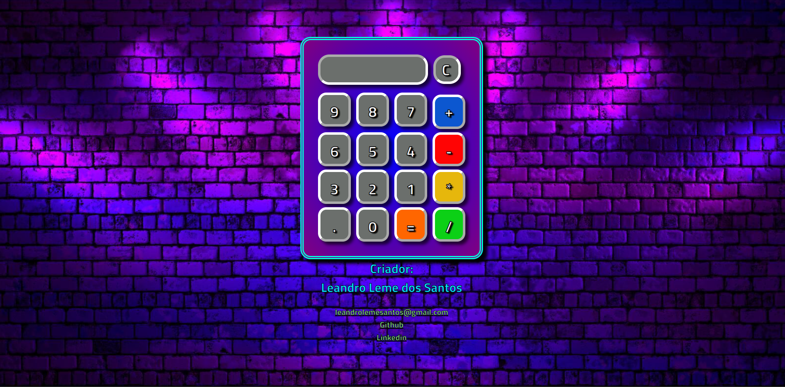

# Calculadora Gamer

Deploy do projeto: <https://calculadoragamer.netlify.app>

## Sobre

É uma calculadora customizada com tema Gamer.

### Objetivo

Treinar minhas habilidades de HTML, CSS e Javascript.

### Desafio

Compreender a lógica por trás da criação de uma calculadora, para melhorar meu conhecimento entre JavaScript, HTML e CSS.

### Conclusão

Consegui finalizar o projeto antes do prazo, confesso que achava muito mais complexo criar uma calculadora, agora vejo que não. Foi uma experiência interessante, com certeza irei desenvolver outra calculadora com mais funções em um próximo projeto.

### Ferramentas Utilizadas

- HTML
- CSS
- JavaScript
